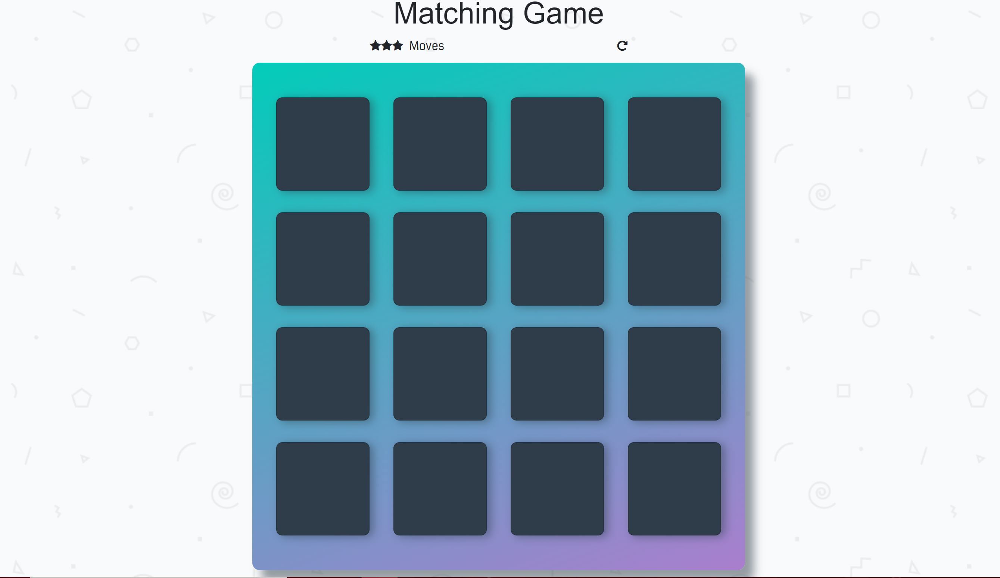
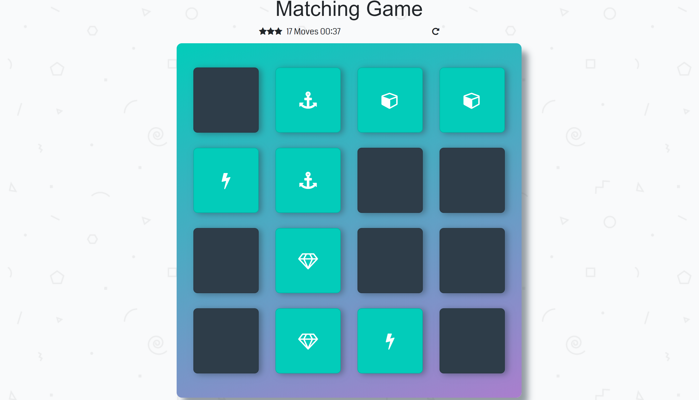
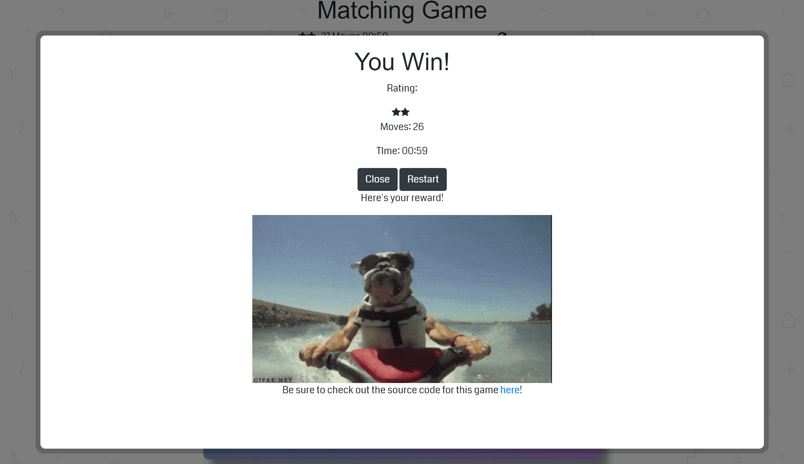

# Memory Game Project
A card matching game created for the Udacity Intro in Programming Nanodegree

## Table of Contents

* [Instructions](#instructions)
* [Screenshots](#screenshots)
* [Built With](#builtwith)

## How to Play
[Click Here to Play]( https://bt93.github.io/memory-game/)

Click on the cards and try to match with the coresponding card. Every two cards clicked a move counter is incremented.
On the first move a timer starts. If you reach 20 moves the first star is removed. If you reach 40 moves the second is removed.
Once you match every card correctly A modal will apear that will give you your final score and prompt you to try again.
If you click restart the game will restart and re-shuffle the cards.

## Screenshots

Game when opened

In the middle of a game

Game won

## Built With

* [HTML](https://www.w3.org/html/)
* CSS
* [JavaScript](https://www.javascript.com/)
* [JQuery](http://jquery.com/) - JavaScript Framework Used
* [Animate.CSS](https://daneden.github.io/animate.css/) - Used to Create the animations in the cards
* [Bootstrap](https://getbootstrap.com/) - Front-End Framework used to create the buttons in the modal